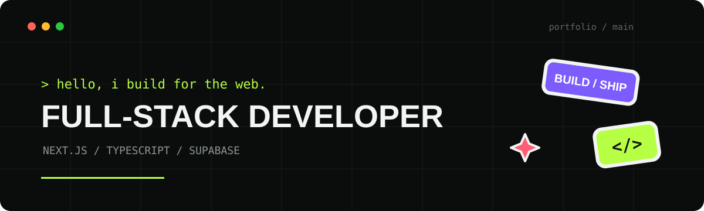
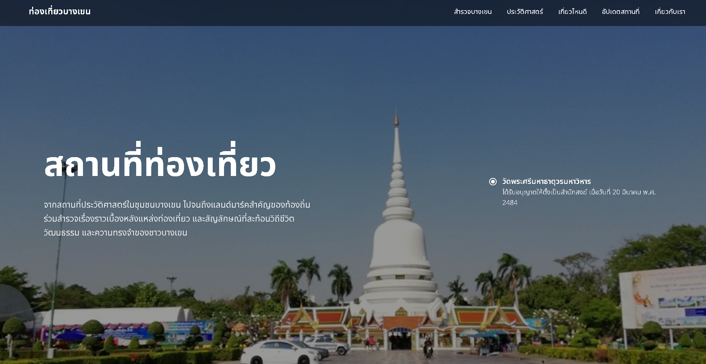
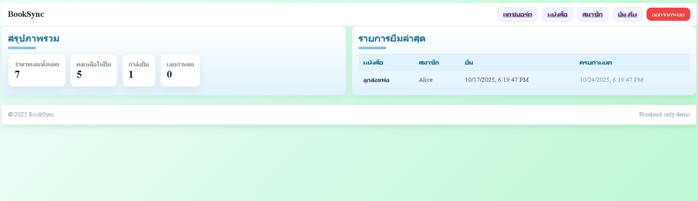

##  About

ผมสนใจงานพัฒนาเว็บไซต์แบบ Full-stack และกำลังฝึกทำโปรเจกต์ที่ใช้งานได้จริง ตั้งแต่การออกแบบหน้าเว็บ เขียนระบบหลังบ้าน ไปจนถึงการจัดการฐานข้อมูล

ตอนนี้ใช้ **Next.js, TypeScript และ Supabase** เป็นหลัก และกำลังพัฒนาทักษะเรื่องโครงสร้างโปรเจกต์ การเขียน Component และ Authentication

---

##  Selected work

<table>
  <tr>
    <td width="43%" valign="middle">
      <a href="https://github.com/pattana-ketchot/bangkhen">
        
      </a>
    </td>
    <td width="57%" valign="middle">
      <h3>Bangkhen</h3>
      <p>เว็บไซต์แนะนำสถานที่ในเขตบางเขน พร้อมระบบ Admin สำหรับจัดการข้อมูล</p>
      <p><code>Next.js</code> <code>TypeScript</code> <code>Supabase</code></p>
      <a href="https://github.com/pattana-ketchot/bangkhen"><strong>View project →</strong></a>
    </td>
  </tr>
</table>

### Project overview

Bangkhen เริ่มจากแนวคิดที่อยากรวบรวมข้อมูลสถานที่ในเขตบางเขนให้อยู่ในที่เดียว เพราะข้อมูลเดิมกระจายอยู่หลายแหล่งและค้นหาได้ไม่สะดวก เว็บไซต์จึงถูกออกแบบให้ผู้ใช้เปิดดูสถานที่ อ่านประวัติ ชมรูปภาพ และกดดูเส้นทางได้ง่ายทั้งบนคอมพิวเตอร์และโทรศัพท์มือถือ

### What I built

- หน้าแรกสำหรับแนะนำพื้นที่และสถานที่ที่น่าสนใจ
- หน้ารายละเอียดเฉพาะสำหรับวัด พิพิธภัณฑ์ สวน ร้านอาหาร และมหาวิทยาลัย
- หน้ารายละเอียดแบบ Dynamic ที่สร้างจาก `slug` และข้อมูลใน Supabase
- Gallery สำหรับแสดงภาพของแต่ละสถานที่
- Google Maps และปุ่มเปิดเส้นทางสำหรับผู้ใช้งาน
- ระบบ Login สำหรับผู้ดูแลด้วย Supabase Authentication
- ระบบเพิ่ม แก้ไข และลบข้อมูลสถานที่แบบ CRUD
- Dashboard สำหรับดูรายการล่าสุด คลังภาพ และกราฟสถิติ

### How it works

เว็บไซต์แบ่งออกเป็นสองส่วน ส่วนแรกเป็นหน้าสาธารณะสำหรับผู้เข้าชม โดยดึงข้อมูลสถานที่จากฐานข้อมูลมาแสดง ส่วนที่สองเป็นระบบ Admin ซึ่งจะตรวจสอบบัญชีและสิทธิ์ก่อนอนุญาตให้เข้าหน้าจัดการข้อมูล เมื่อผู้ดูแลเพิ่มสถานที่ใหม่ ระบบสามารถนำ `slug` ไปสร้าง URL ของหน้ารายละเอียดได้โดยไม่ต้องสร้างหน้าใหม่ทุกครั้ง

### My responsibilities

ผมพัฒนาทั้งส่วน Frontend และการเชื่อมต่อ Backend ตั้งแต่การแบ่งหน้าออกเป็น React Components การทำ Responsive Layout การเชื่อมต่อ Supabase ไปจนถึงการสร้างระบบ Authentication, CRUD และ Dashboard

### What I learned

- การจัดโครงสร้างโปรเจกต์ด้วย Next.js App Router
- การแยก Component เพื่อให้อ่านและแก้ไขโค้ดได้ง่ายขึ้น
- การออกแบบข้อมูลและเชื่อมต่อฐานข้อมูลผ่าน Supabase
- การตรวจสอบ Session และ Role ก่อนเข้าใช้งานหน้า Admin
- การจัดการ Loading, Error และสถานะที่ไม่พบข้อมูล
- การใช้ Git และ GitHub เพื่อติดตามการเปลี่ยนแปลงของโปรเจกต์

### Next improvements

- เพิ่มระบบค้นหาและกรองสถานที่ตามหมวดหมู่
- ปรับระบบอัปโหลดและจัดการรูปภาพให้สะดวกขึ้น
- เพิ่มการทดสอบส่วนสำคัญของระบบ
- ปรับปรุง Accessibility และประสิทธิภาพการโหลดหน้าเว็บ
- Deploy เว็บไซต์เพื่อเปิดเป็น Live Demo

<br>

### BookSync — Library Borrowing System

<p align="center">
  <a href="https://github.com/pattana-ketchot/-Booksync">
    
  </a>
</p>

ระบบจัดการห้องสมุดสำหรับดูแลหนังสือ สมาชิก และรายการยืม–คืน พัฒนาเป็น Full-stack project โดยแยก Vue Frontend และ Node.js API ออกจากกัน

`Vue 3` · `Pinia` · `Vue Router` · `Node.js` · `Express` · `MySQL`

**[View project files →](https://github.com/pattana-ketchot/-Booksync)**

### Project overview

BookSync ถูกสร้างขึ้นเพื่อทดลองแก้ปัญหาการจัดการข้อมูลภายในห้องสมุดขนาดเล็ก แทนการจดรายการหนังสือ สมาชิก และประวัติการยืมคืนแยกกัน ผู้ดูแลสามารถดูภาพรวมและจัดการงานหลักจากเว็บแอปพลิเคชันเดียว

### What I built

- หน้า Dashboard สรุปจำนวนหนังสือ หนังสือที่พร้อมให้ยืม สมาชิก และรายการยืมล่าสุด
- ระบบเพิ่ม แก้ไข ลบ และค้นหาหนังสือ
- ระบบเพิ่ม แก้ไข ลบ และค้นหาสมาชิก
- ระบบยืมและคืนหนังสือ พร้อมคำนวณวันครบกำหนด
- ตรวจสอบจำนวนหนังสือคงเหลือก่อนทำรายการยืม
- ป้องกันการลบหนังสือหรือสมาชิกที่ยังมีรายการยืมค้างอยู่
- หน้าสมัครสมาชิกและเข้าสู่ระบบที่เชื่อมต่อ Node.js API

### Architecture

Frontend พัฒนาด้วย Vue 3 และใช้ Pinia จัดการ State ของหนังสือ สมาชิก และรายการยืมคืน ข้อมูลส่วนนี้ถูกบันทึกใน `localStorage` เพื่อให้ยังอยู่หลัง Refresh หน้าเว็บ ส่วนระบบสมัครสมาชิกและเข้าสู่ระบบเรียก REST API ผ่าน Axios ไปยัง Express Server ซึ่งเชื่อมต่อกับ MySQL

```text
Vue 3 + Pinia  →  Axios  →  Express API  →  MySQL
       │
       └── Library data → localStorage
```

### My responsibilities

ผมพัฒนาหน้าเว็บ Vue, ออกแบบ Components ที่นำกลับมาใช้ซ้ำได้, จัดการ State ด้วย Pinia, สร้าง Logic การยืมคืน และพัฒนา API สำหรับ Register/Login ด้วย Express และ MySQL

### What I learned

- การสร้าง Single-page Application ด้วย Vue 3 และ Vue Router
- การจัดการ State ส่วนกลางด้วย Pinia
- การออกแบบ Components เช่น Button, Input, Select และ Card ให้ใช้ซ้ำได้
- การเรียก REST API ด้วย Axios และจัดการผลลัพธ์จาก Server
- การสร้าง API ด้วย Express และใช้ Parameterized Query กับ MySQL
- การแบ่ง Frontend และ Backend เป็นคนละโปรเจกต์

### Next improvements

- ย้ายข้อมูลหนังสือ สมาชิก และการยืมคืนจาก `localStorage` ไปเก็บใน MySQL
- เพิ่มการเข้ารหัสรหัสผ่านและระบบ Token สำหรับ Authentication
- เพิ่ม Route Guard เพื่อป้องกันหน้าที่ต้องเข้าสู่ระบบ
- เพิ่มการตรวจสอบข้อมูลทั้งฝั่ง Frontend และ API
- เพิ่มระบบแจ้งเตือนรายการยืมที่ใกล้ครบกำหนด

---

##  Stack

```text
Frontend     Next.js / React / Vue 3 / TypeScript / Tailwind CSS
State        Pinia / localStorage
Backend      Supabase / Node.js / Express / MySQL
Tools        Git / GitHub / VS Code
```

##  Contact

GitHub — **[@pattana-ketchot](https://github.com/pattana-ketchot)**
